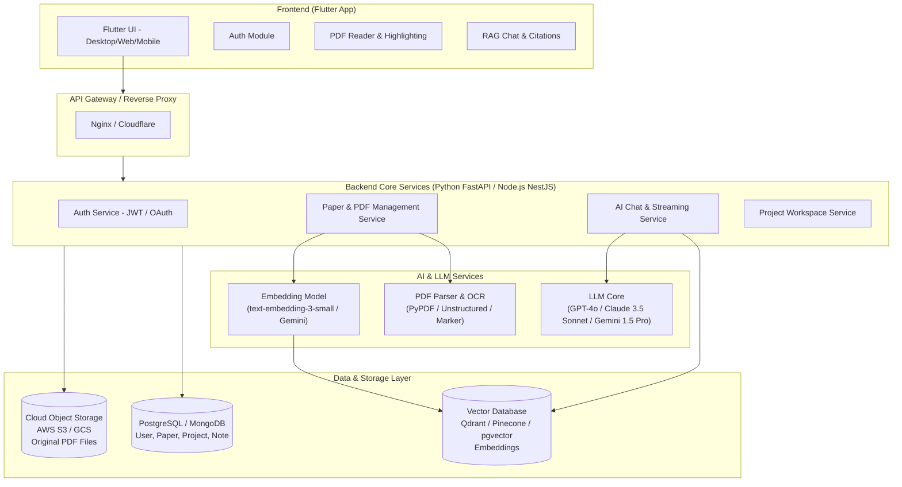
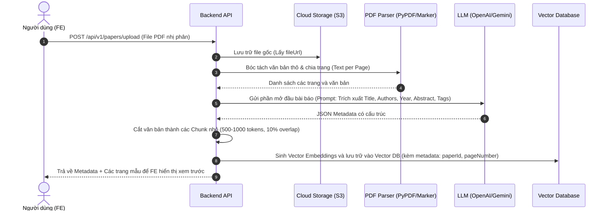
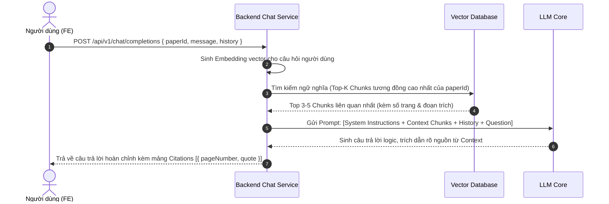

# KIẾN TRÚC BACKEND & AI RAG PIPELINE
**Dự án:** Paper Chat with AI  
**Tài liệu:** Backend Architecture, Database Schema & AI RAG Pipeline

---

## 1. KIẾN TRÚC TỔNG THỂ HỆ THỐNG (SYSTEM ARCHITECTURE)

---

## 2. QUY TRÌNH XỬ LÝ FILE PDF & TRÍCH XUẤT AI (PDF INGESTION PIPELINE)

Khi người dùng chọn file PDF từ máy và tải lên:

---

## 3. QUY TRÌNH HỎI ĐÁP RAG & TRÍCH DẪN (RETRIEVAL-AUGMENTED GENERATION)

---

## 4. BẢNG DỮ LIỆU ĐỀ XUẤT (DATABASE SCHEMA - POSTGRESQL / MONGODB)

### 4.1. Bảng `users`
* `id`: VARCHAR(36) (Primary Key, UUID)
* `email`: VARCHAR(255) (Unique, Indexed)
* `password_hash`: VARCHAR(255) (Null nếu đăng nhập Google)
* `name`: VARCHAR(255)
* `plan`: VARCHAR(50) (Mặc định: `'Free'`)
* `avatar_url`: TEXT
* `created_at`: TIMESTAMP WITH TIME ZONE

### 4.2. Bảng `papers`
* `id`: VARCHAR(36) (Primary Key)
* `user_id`: VARCHAR(36) (Foreign Key -> `users.id`)
* `title`: TEXT (Indexed)
* `authors`: TEXT[] (Mảng tác giả)
* `year`: INT
* `collection`: VARCHAR(100) (Chủ đề phân loại)
* `tags`: TEXT[] (Mảng thẻ)
* `abstract_text`: TEXT
* `pdf_url`: TEXT (Đường link tải file từ S3/GCS)
* `is_favorite`: BOOLEAN (Mặc định: `false`)
* `total_pages`: INT
* `created_at`: TIMESTAMP WITH TIME ZONE

### 4.3. Bảng `paper_pages`
* `id`: VARCHAR(36) (Primary Key)
* `paper_id`: VARCHAR(36) (Foreign Key -> `papers.id` ON DELETE CASCADE)
* `page_number`: INT
* `section_title`: VARCHAR(255)
* `content`: TEXT

### 4.4. Bảng `projects`
* `id`: VARCHAR(36) (Primary Key)
* `user_id`: VARCHAR(36) (Foreign Key -> `users.id`)
* `name`: VARCHAR(255)
* `description`: TEXT
* `color`: VARCHAR(20) (Mã hex màu, ví dụ: `'0xFF3B82F6'`)
* `created_at`: TIMESTAMP WITH TIME ZONE

### 4.5. Bảng liên kết `project_papers`
* `project_id`: VARCHAR(36) (Foreign Key -> `projects.id` ON DELETE CASCADE)
* `paper_id`: VARCHAR(36) (Foreign Key -> `papers.id` ON DELETE CASCADE)
* `Primary Key (project_id, paper_id)`

### 4.6. Bảng `notes`
* `id`: VARCHAR(36) (Primary Key)
* `user_id`: VARCHAR(36) (Foreign Key -> `users.id`)
* `paper_id`: VARCHAR(36) (Null nếu là ghi chú tự do)
* `title`: VARCHAR(255)
* `content`: TEXT
* `created_at`: TIMESTAMP WITH TIME ZONE

---

## 5. CÔNG NGHỆ KHUYẾN NGHỊ CHO PHÍA BACKEND

1. **Framework:** 
   - **Lựa chọn hàng đầu (Khuyên dùng):** **Python (FastAPI)** — Tương thích tốt nhất với hệ sinh thái AI/Data Science (PyPDF, LangChain, LlamaIndex, NumPy).
   - **Lựa chọn thay thế:** **Node.js (NestJS / Express)** hoặc **Go** kết hợp gọi AI SDK.
2. **Vector Database:**
   - **Qdrant** (Open-source, cực nhanh, hỗ trợ lọc theo payload `paperId`, `userId`).
   - Hoặc **pgvector** tích hợp trực tiếp vào PostgreSQL nếu muốn đơn giản hóa hạ tầng.
3. **Mô hình AI đề xuất:**
   - **Embeddings:** `text-embedding-3-small` (OpenAI) hoặc `text-embedding-004` (Google Gemini) - Chi phí cực rẻ, tốc độ cao.
   - **Chat LLM:** `gpt-4o-mini` / `gemini-1.5-flash` (cho tốc độ phản hồi nhanh, giá rẻ) hoặc `gpt-4o` / `claude-3-5-sonnet` (cho các truy vấn học thuật phức tạp).

