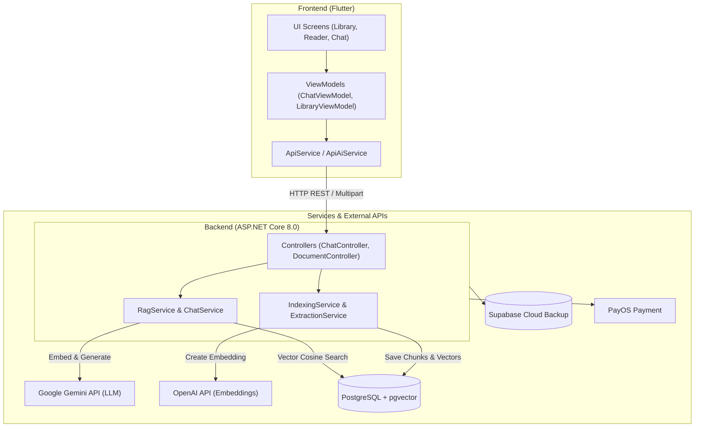

# 📚 Paper AI & RAG ChatBot (Paperdesk)

Hệ thống Đọc và Trợ lý Trí tuệ Nhân tạo Hỏi đáp Tài liệu Chuyên sâu (Academic Research Paper Reader & RAG ChatBot). 

Hệ thống cho phép tải lên, xử lý tự động (Trích xuất văn bản, Chia đoạn - Chunking, Tạo vector embedding) và lưu trữ các bài báo khoa học, giáo trình, tài liệu (PDF, DOCX, PPTX). Người dùng và sinh viên có thể tương tác hỏi đáp thông minh với AI (sử dụng kỹ thuật RAG - Retrieval-Augmented Generation) với câu trả lời chính xác kèm trích dẫn chi tiết từng nguồn tài liệu.

---

## 🛠 Tech Stack (Công Nghệ Sử Dụng)

### 🎨 Frontend (Ứng dụng Client)
- **Framework**: [Flutter](https://flutter.dev/) (Dart 3.x) - Hỗ trợ đa nền tảng (Web, Windows Desktop, Android, iOS).
- **Architecture**: ViewModel Pattern (ChangeNotifier / Provider).
- **UI & Theme**: Material Design 3, Google Fonts (`Inter`, `JetBrains Mono`), Dynamic Light/Dark Mode.
- **Packages**:
  - `http`: Giao tiếp RESTful API & Multipart Upload.
  - `flutter_markdown`: Hiển thị định dạng Markdown và công thức toán học từ câu trả lời AI.
  - `file_picker`: Chọn tệp tin PDF/DOCX/PPTX từ hệ thống.
  - `shared_preferences`: Lưu trữ cấu hình người dùng cục bộ.

---

### ⚙️ Backend (API Server)
- **Framework**: [ASP.NET Core 8.0 Web API](https://dotnet.microsoft.com/)
- **Kiến trúc (Architecture)**: Clean Architecture / Multi-layered Architecture:
  - `BusinessObject`: Chứa các Entities, Models (Document, DocumentChunk, ChatHistory, User, Subject,...).
  - `DataAccessLayer`: Quản lý DbContext, Migrations và Repositories Pattern với EF Core.
  - `ServiceLayer`: Chứa toàn bộ Business Logic (Indexing, Text Extraction, Chunking, Embedding, RAG Engine, Backup).
  - `ChatBot`: Web API Project chứa Controllers, SignalR Hubs, Middleware và Swagger Documentation.
- **ORM & Database Provider**: Entity Framework Core 8.0 + `Npgsql.EntityFrameworkCore.PostgreSQL`.
- **Real-time Communication**: ASP.NET Core SignalR (`NotificationHub`) phục vụ thông báo tiến trình nền.
- **Authentication & Security**: Cookie-based Authentication, Google OAuth 2.0, BCrypt Password Hashing.

---

### 🧠 AI & RAG Engine (Lõi Trí Tuệ Nhân Tạo)
- **LLM Provider**: **Google Gemini API** (`gemini-1.5-flash`) & **OpenAI API**.
- **Vector Embedding**: OpenAI `text-embedding-ada-002` / Gemini Embedding (Vector 1536 chiều).
- **Text Extraction**:
  - `iText7`: Trích xuất nội dung văn bản từ tệp PDF.
  - `DocumentFormat.OpenXml`: Trích xuất nội dung từ tệp DOCX và PPTX.
  - `GrobidService`: Kết nối dịch vụ GROBID để phân tích cấu trúc bài báo khoa học.
- **Chunking Strategy**: Thuật toán chia nhỏ văn bản thông minh (độ dài mặc định 512 ký tự, overlap 50 ký tự) tối ưu hóa cho tiếng Việt và tiếng Anh.
- **Citation Engine**: Thuật toán tự động phân tích và trích xuất chỉ số nguồn `[1]`, `[2]` và tổng hợp danh sách `[SOURCES]` cuối câu trả lời.

---

### 🗄 Database & Storage (Cơ Sở Dữ Liệu & Lưu Trữ)
- **Primary Database**: PostgreSQL 15+
- **Vector Extension**: [`pgvector`](https://github.com/pgvector/pgvector) hỗ trợ lưu trữ vector embedding và truy vấn khoảng cách Cosine/L2 siêu tốc.
- **File Storage**: Local Disk Storage (cấu hình đường dẫn upload linh hoạt).
- **Backup Service**: `DatabaseBackupService` tự động sao lưu dữ liệu quan trọng lên Supabase Cloud.

---

### 💳 Payment & Integration (Tích Hợp Khác)
- **Payment Gateway**: Integration với **PayOS API** phục vụ thanh toán gói dịch vụ/đăng ký.

---

## 🏗 Kiến Trúc Hệ Thống (System Architecture)



---

## ✨ Tính Năng Nổi Bật

1. 📖 **Đọc & Quản lý Tài liệu Chuyên sâu**:
   - Thư viện quản lý các bài báo khoa học, giáo trình với bộ lọc theo thẻ (tags), bộ sưu tập (collections), năm xuất bản.
   - Giao diện đọc tài liệu mượt mà, hỗ trợ chọn văn bản trực tiếp để chèn vào ngữ cảnh câu hỏi.

2. 🤖 **Hỏi đáp AI với RAG (Retrieval-Augmented Generation)**:
   - Tìm kiếm ngữ cảnh liên quan nhất bằng thuật toán Cosine Similarity trên cơ sở dữ liệu Vector.
   - AI trả lời chính xác dựa trên tài liệu được cung cấp, tuyệt đối không bịa đặt (hallucination).
   - Chèn nhãn trích dẫn số `[1]`, `[2]` ngay sau từng luận điểm và liệt kê nguồn gốc cụ thể ở cuối câu trả lời.

3. ⚡ **Tải lên & Tự động Lập chỉ mục (Indexing Engine)**:
   - Tải tệp PDF, DOCX, PPTX lên hệ thống.
   - Xử lý đa luồng chạy ngầm: Extract Text → Split Chunks → Embed Vector → Save to DB.
   - Cơ chế tự động Rollback và xóa file rác nếu quá trình xử lý gặp lỗi.

4. 🛡 **Bảo mật & Quản lý người dùng**:
   - Phân quyền theo vai trò (Admin, Lecturers, Students).
   - Đăng nhập bảo mật qua Cookie / Google OAuth 2.0.

---

## 📁 Cấu Trúc Thư Mục Project

```
PRM_LAB1/
├── ChatBot.slnx                # Visual Studio Solution File
├── .env                         # Biến môi trường hệ thống
│
├── BusinessObject/              # Entities, DTOs & Models
│   └── Entities/                # Document, DocumentChunk, ChatHistory, User...
│
├── DataAccessLayer/             # EF Core DbContext, Repositories, Migrations
│   ├── Migrations/              # Database Migration scripts (kèm pgvector)
│   └── Repositories/            # Implementation & Interfaces của Repositories
│
├── ServiceLayer/                # Business Logic Services
│   ├── Services/                # Indexing, Chunking, Embedding, RAG, FileUpload, Chat
│   └── Interfaces/              # Interfaces của các Services
│
├── ChatBot/                     # Web API Startup Project
│   ├── Controllers/             # ChatController, DocumentController, AuthController
│   ├── Hubs/                    # NotificationHub (SignalR)
│   └── Program.cs               # DI Configuration, CORS, Pipeline setup
│
└── FE/                          # Frontend Flutter Application
    ├── lib/
    │   ├── app/                 # Theme, Localization, Typography
    │   ├── features/            # Screens & ViewModels (Chat, Reader, Library, Auth)
    │   ├── models/              # Dart Models (Paper, ChatMessage, Note)
    │   └── services/            # ApiService, ApiAiService, ApiPaperRepository
    └── pubspec.yaml             # Flutter Dependencies
```

---

## 🚀 Hướng Dẫn Setup và Chạy Dự Án

### 1. Yêu Cầu Tiền Đề (Prerequisites)
- [.NET 8.0 SDK](https://dotnet.microsoft.com/download/dotnet/8.0)
- [Flutter SDK (3.13+)](https://docs.flutter.dev/get-started/install)
- [PostgreSQL (15+)](https://www.postgresql.org/download/) đã cài đặt extension [pgvector](https://github.com/pgvector/pgvector).

---

### 2. Cấu Hình Biến Môi Trường (Environment Setup)

Tạo file `.env` tại thư mục gốc của project (cùng cấp với `ChatBot.slnx`):

```env
# Database Connection String
ConnectionStrings__DefaultConnection=Host=localhost;Database=PaperAI_DB;Username=postgres;Password=your_password

# Gemini & OpenAI API Keys
GEMINI_API_KEY=AIzaSy...
OPENAI_API_KEY=sk-...

# Storage Config
UploadFolderPath=D:\Upload
MaxFileSize=314572800
ChunkSize=512

# PayOS (Tùy chọn)
PAYOS_CLIENT_ID=your_client_id
PAYOS_API_KEY=your_api_key
PAYOS_CHECKSUM_KEY=your_checksum_key
```

Cập nhật chuỗi kết nối trong `ChatBot/appsettings.json` nếu cần:
```json
{
  "ConnectionStrings": {
    "DefaultConnection": "Host=localhost;Database=PaperAI_DB;Username=postgres;Password=your_password"
  }
}
```

---

### 3. Cập Nhật Cơ Sở Dữ Liệu (EF Core Migration)

Mở Terminal tại thư mục gốc và chạy lệnh cập nhật DB:
```bash
dotnet ef database update --project DataAccessLayer --startup-project ChatBot
```

---

### 4. Chạy Backend API Server

```bash
cd ChatBot
dotnet run
```
- **Web API Endpoint**: `http://localhost:5000`
- **Swagger Documentation**: `http://localhost:5000/swagger`

---

### 5. Chạy Frontend Flutter App

Mở cửa sổ Terminal mới:
```bash
cd FE
flutter pub get
flutter run -d chrome    # Chạy trên Trình duyệt Web
# Hoặc: flutter run -d windows (Chạy ứng dụng Windows Desktop)
```

---

## 📡 Danh Sách Endpoints API Chính

| Method | Endpoint | Mô tả |
| :--- | :--- | :--- |
| `POST` | `/api/chat/ask` | Gửi câu hỏi RAG kèm `documentId` hoặc `userId` |
| `GET` | `/api/chat/history` | Lấy danh sách lịch sử hỏi đáp |
| `GET` | `/api/document` | Lấy danh sách tài liệu đã index thành công |
| `POST` | `/api/document/upload` | Upload tệp PDF/DOCX/PPTX mới lên hệ thống |
| `POST` | `/api/document/{id}/reindex` | Yêu cầu tái chỉ mục (Re-index) tài liệu |
| `DELETE`| `/api/document/{id}` | Xóa tài liệu và các vector chunks liên quan |

---

## 📄 Giấy Phép (License)

Dự án được phát hành dưới bản quyền [MIT License](LICENSE.txt).