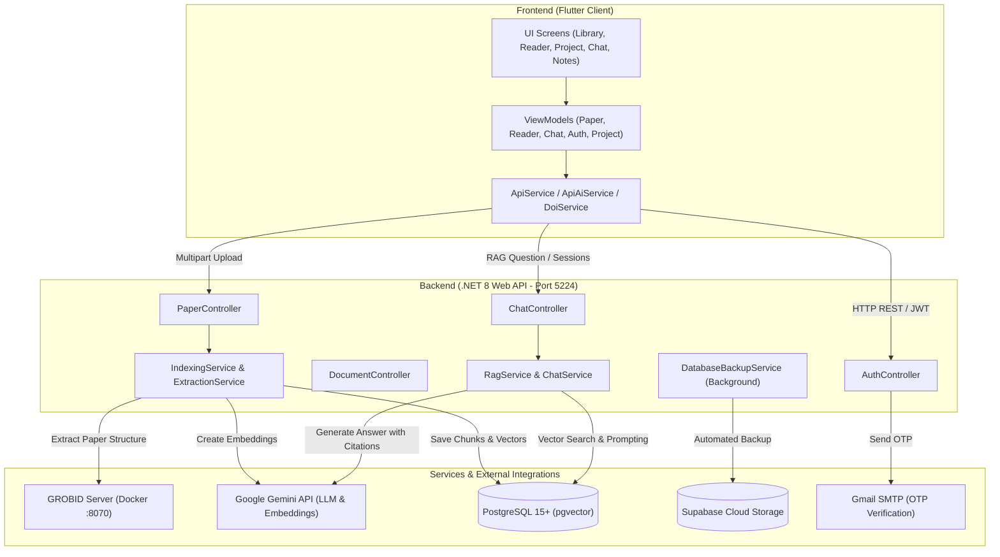

# 📚 Paperdesk (Paper AI & RAG ChatBot)

Hệ thống Đọc, Quản lý và Trợ lý AI Hỏi đáp Tài liệu Nghiên cứu Khoa học Chuyên sâu (**Academic Research Paper Reader & RAG Workstation**).

Hệ thống hỗ trợ tải lên, phân tích cấu trúc bài báo tự động qua **GROBID**, bóc tách siêu dữ liệu (Metadata, Abstract, Danh mục tài liệu tham khảo - References, DOI, arXiv), trích xuất văn bản, chia đoạn thông minh (Chunking) và tạo vector embedding lưu trữ vào **PostgreSQL (pgvector)**. 

Người dùng có thể đọc bài báo với 2 chế độ (Đọc tóm tắt Markdown và Đọc PDF gốc chất lượng cao), tra cứu trích dẫn trực tiếp tới trang gốc của bài báo qua DOI/arXiv, đồng thời tương tác hỏi đáp thông minh với AI (sử dụng kỹ thuật **RAG - Retrieval-Augmented Generation**). Phản hồi của AI chuẩn xác, tích hợp công thức toán LaTeX và các nhãn trích dẫn số `[1]`, `[2]` có thể nhấp trực tiếp để truy nguyên tài liệu.

---

## 🚀 Điểm Mới Trong Phiên Bản Hiện Tại

- 🔬 **Tích hợp GROBID Service (Docker)**: Tự động trích xuất thông tin chuyên sâu của bài báo khoa học (Tiêu đề, Tác giả, Năm xuất bản, Tóm tắt Abstract, Cấu trúc đề mục, Danh sách trích dẫn tham khảo).
- 📑 **Trình Đọc PDF Gốc Trực Quan (`pdfrx`)**: Cho phép chuyển đổi linh hoạt giữa chế độ đọc định dạng Markdown và giao diện đọc file PDF gốc với độ mượt mà cao, hỗ trợ zoom, scroll và nhảy trang tức thì.
- 🔗 **Smart Citations & Trực Quan Hóa Nguồn Gốc**:
  - Các nhãn trích dẫn `[1]`, `[2]` trong câu trả lời AI có thể click trực tiếp để tra cứu nhanh nguồn trích dẫn.
  - Phân giải tự động liên kết **DOI** (`https://doi.org/...`) và **arXiv** (`https://arxiv.org/abs/...`) trong danh mục tài liệu tham khảo để mở bài báo gốc trên trình duyệt chỉ với 1 click.
- 💬 **Quản Lý Phiên Chat (Multi-Session Chat)**: Tạo nhiều cuộc trò chuyện độc lập cho từng bài báo hoặc dự án nghiên cứu, lưu lịch sử trò chuyện và hỗ trợ đổi tên phiên chat linh hoạt.
- 📁 **Không Gian Nghiên Cứu Theo Dự Án (Project Workspace)**: Tổ chức và gom nhóm các bài báo theo đề tài/dự án nghiên cứu để hỏi đáp AI tổng hợp xuyên suốt nhiều tài liệu.
- 🔐 **Xác Thực OTP Qua Email & JWT**: Đăng ký và đăng nhập bảo mật với mã xác thực OTP gửi trực tiếp qua Gmail SMTP, cấp phát JWT Bearer Token an toàn.
- ☁️ **Sao Lưu Đám Mây Tự Động (Supabase Cloud Backup)**: Dịch vụ chạy ngầm định kỳ sao lưu cơ sở dữ liệu PostgreSQL bằng `pg_dump` và lưu trữ an toàn trên Supabase Storage.

---

## 🛠 Tech Stack (Công Nghệ Sử Dụng)

### 🎨 Frontend (Client Flutter App)
- **Framework**: [Flutter](https://flutter.dev/) (Dart 3.x) - Đa nền tảng: Web (Chrome), Windows Desktop, Android.
- **Kiến trúc**: ViewModel Pattern (`ChangeNotifier` / `ListenableBuilder`).
- **Thư viện chính**:
  - `pdfrx`: Trình đọc PDF native hiệu năng cao, hiển thị mượt mà.
  - `flutter_markdown_plus` & `flutter_math_fork`: Hiển thị định dạng Markdown và công thức toán học LaTeX/KaTeX từ câu trả lời của AI.
  - `google_fonts`: Phông chữ hiện đại (`Inter`, `JetBrains Mono`).
  - `url_launcher`: Điều hướng mở liên kết ngoài (DOI, arXiv, Website).
  - `file_picker`: Chọn tệp PDF/DOCX/PPTX từ hệ thống.
  - `shared_preferences`: Lưu trữ cấu hình cục bộ (Theme, URL API tùy chỉnh).

---

### ⚙️ Backend (ASP.NET Core 8.0 Web API)
- **Framework**: [.NET 8.0 Web API](https://dotnet.microsoft.com/)
- **Kiến trúc Clean Architecture**:
  - `BusinessObject`: Entities, DTOs, Enums (Paper, Document, DocumentChunk, DocumentReference, ChatSession, ChatHistory, User,...).
  - `DataAccessLayer`: `AppDbContext`, Migrations, Generic Repository & Specific Repositories (`PaperRepository`, `DocumentRepository`,...).
  - `ServiceLayer`: Business logic (Indexing, Chunking, Embedding, RAG Engine, Paper Service, Backup Service).
  - `ChatBot`: Web API Controllers (`AuthController`, `PaperController`, `DocumentController`, `ChatController`), SignalR Hubs, Middleware.
- **ORM & Database**: Entity Framework Core 8.0 + `Npgsql.EntityFrameworkCore.PostgreSQL`.
- **Bảo mật & Authentication**: JWT Bearer Token, Google OAuth 2.0, BCrypt Password Hashing, xác thực OTP qua SMTP.
- **Real-time**: ASP.NET Core SignalR (`NotificationHub`) phục vụ thông báo tiến trình nền.
- **Cloud Backup**: `DatabaseBackupService` tích hợp `pg_dump` và Supabase Storage C#.

---

### 🧠 AI & Khai Thác Dữ Liệu
- **LLM Provider**: **Google Gemini API** (`gemini-1.5-flash` / `gemini-1.5-pro`) hoặc OpenAI API.
- **Vector Embedding**: Gemini Embedding / OpenAI Embedding (Vector 1536 chiều).
- **Phân tích Cấu trúc Bài báo**: **GROBID Server** (`lfoppiano/grobid:0.8.0`) chạy qua Docker.
- **Xử lý tài liệu khác**: `iText7` (PDF), `DocumentFormat.OpenXml` (DOCX, PPTX).
- **Chunking Engine**: Thuật toán phân đoạn tối ưu (độ dài 512–2000 ký tự có overlap).
- **Cơ sở dữ liệu Vector**: PostgreSQL tích hợp extension [`pgvector`](https://github.com/pgvector/pgvector) hỗ trợ tìm kiếm ngữ nghĩa theo Cosine Similarity.

---

## 🏗 Sơ Đồ Kiến Trúc Hệ Thống


```mermaid
graph TD
    subgraph Frontend ["Frontend (Flutter Client)"]
        UI["UI Screens (Library, Reader, Project, Chat, Notes)"]
        VM["ViewModels (Paper, Reader, Chat, Auth, Project)"]
        Svc["ApiService / ApiAiService / DoiService"]
        UI --> VM --> Svc
    end

    subgraph Backend ["Backend (.NET 8 Web API - Port 5224)"]
        AuthCtrl["AuthController"]
        PaperCtrl["PaperController"]
        DocCtrl["DocumentController"]
        ChatCtrl["ChatController"]
        
        RagEngine["RagService & ChatService"]
        IndexEngine["IndexingService & ExtractionService"]
        BackupSvc["DatabaseBackupService (Background)"]

        Svc -->|HTTP REST / JWT| AuthCtrl
        Svc -->|Multipart Upload| PaperCtrl
        Svc -->|RAG Question / Sessions| ChatCtrl
        
        PaperCtrl --> IndexEngine
        ChatCtrl --> RagEngine
    end

    subgraph External ["Services & External Integrations"]
        Grobid["GROBID Server (Docker :8070)"]
        Gemini["Google Gemini API (LLM & Embeddings)"]
        PgVector[("PostgreSQL 15+ (pgvector)")]
        Supabase[("Supabase Cloud Storage")]
        Gmail["Gmail SMTP (OTP Verification)"]
        
        IndexEngine -->|Extract Paper Structure| Grobid
        IndexEngine -->|Create Embeddings| Gemini
        IndexEngine -->|Save Chunks & Vectors| PgVector
        RagEngine -->|Vector Search & Prompting| PgVector
        RagEngine -->|Generate Answer with Citations| Gemini
        BackupSvc -->|Automated Backup| Supabase
        AuthCtrl -->|Send OTP| Gmail
    end
```

---

## 📁 Cấu Trúc Thư Mục Dự Án

```
ChatBot/
├── ChatBot.slnx                      # Visual Studio Solution File
├── .env                               # File biến môi trường hệ thống
├── docker-compose.yml                 # Cấu hình Docker chạy GROBID Server
│
├── BusinessObject/                    # Entities, DTOs & Models
│   ├── Entities/                      # Paper, Document, DocumentChunk, ChatSession, User...
│   └── Dtos/                          # DocumentReferenceDto, ChatRequestDto...
│
├── DataAccessLayer/                   # EF Core DbContext, Repositories, Migrations
│   ├── AppDbContext.cs                # DbContext cấu hình pgvector
│   ├── Migrations/                    # Toàn bộ script database migrations
│   └── Repositories/                  # Interfaces và Implements của Repositories
│
├── ServiceLayer/                      # Business Logic Services
│   ├── Services/                      # RagService, IndexingService, GrobidService, 
│   │                                  # ChatService, EmbeddingService, DatabaseBackupService
│   └── Interfaces/                    # Interface trừu tượng cho DI
│
├── ChatBot/                           # Web API Host Project
│   ├── Controllers/                   # AuthController, PaperController, ChatController, DocumentController
│   ├── Hubs/                          # SignalR NotificationHub
│   ├── appsettings.json               # Cấu hình dự phòng / kết nối
│   └── Program.cs                     # Cấu hình Dependency Injection, CORS, JWT, Middleware
│
└── FE/                                # Flutter Frontend Application
    ├── lib/
    │   ├── app/                       # Themes, Localization, Hằng số màu sắc
    │   ├── features/                  # UI & ViewModels theo từng module:
    │   │   ├── auth/                  # Đăng ký, Đăng nhập, Nhập OTP
    │   │   ├── library/               # Danh sách bài báo, Tải file, Lọc tìm kiếm
    │   │   ├── reader/                # Trình đọc PDF/Markdown, Bảng References
    │   │   ├── chat/                  # Khung chat RAG, Chat Sessions, Message Bubble
    │   │   ├── projects/              # Quản lý không gian đề tài nghiên cứu
    │   │   ├── notes/                 # Ghi chú học tập / nghiên cứu
    │   │   └── settings/              # Cài đặt giao diện & Cấu hình API Endpoint
    │   ├── models/                    # Dart Models (Paper, ChatSession, DocumentReference...)
    │   └── services/                  # ApiService, ApiAiService, DoiService...
    └── pubspec.yaml                   # Danh sách Flutter Dependencies
```

---

## ⚙️ Yêu Cầu Tiền Đề (Prerequisites)

Trước khi chạy dự án, hãy đảm bảo máy tính của bạn đã cài đặt:
1. **[.NET 8.0 SDK](https://dotnet.microsoft.com/download/dotnet/8.0)**
2. **[Flutter SDK (>= 3.13)](https://docs.flutter.dev/get-started/install)** (kèm Google Chrome cho Web hoặc Visual Studio C++ cho Windows Desktop)
3. **[Docker Desktop](https://www.docker.com/products/docker-desktop/)** (dùng để khởi chạy GROBID)
4. **[PostgreSQL (15+)](https://www.postgresql.org/download/)** đã cài đặt extension **[pgvector](https://github.com/pgvector/pgvector)**

---

## 🚀 Hướng Dẫn Cài Đặt và Khởi Chạy

### Bước 1: Khởi động GROBID Server bằng Docker

GROBID chịu trách nhiệm bóc tách cấu trúc bài báo (Title, Abstract, Tác giả, References). Mở Terminal tại thư mục gốc của project:

```bash
docker-compose up -d
```
> Kiểm tra GROBID đang hoạt động tại: `http://localhost:8070`

---

### Bước 2: Cài Đặt Cơ Sở Dữ Liệu PostgreSQL & pgvector

1. Mở công cụ quản lý PostgreSQL (như **pgAdmin** hoặc **psql**).
2. Tạo mới một cơ sở dữ liệu có tên `ChatBotDb` (hoặc tên bạn muốn).
3. Chạy câu lệnh SQL sau để kích hoạt extension vector:
   ```sql
   CREATE EXTENSION IF NOT EXISTS vector;
   ```

---

### Bước 3: Cấu Hình Biến Môi Trường (`.env`)

Tạo hoặc cập nhật tệp `.env` tại thư mục gốc của dự án (cùng cấp với `ChatBot.slnx`):

```env
# 1. Cấu hình gửi Mail OTP (Sử dụng Gmail SMTP và App Password)
EMAIL_HOST=smtp.gmail.com
EMAIL_PORT=587
EMAIL_USER=your_email@gmail.com
EMAIL_PASS=your_gmail_app_password

# 2. Cấu hình Cloud Backup lên Supabase (Tùy chọn)
SUPABASE_URL=https://your-project.supabase.co
SUPABASE_SERVICE_KEY=your_supabase_service_role_key
SUPABASE_BACKUP_BUCKET=database-backups
PG_DUMP_PATH=C:\Program Files\PostgreSQL\18\bin\pg_dump.exe

# 3. Khóa API Gemini cho AI & Embeddings
GEMINI_API_KEY=AIzaSy...your_gemini_api_key...

# 4. Cấu hình lưu trữ tệp tải lên
UploadFolderPath=D:\Upload
MaxFileSize=314572800
ChunkSize=2000

# 5. Chuỗi kết nối Database PostgreSQL
ConnectionStrings__DefaultConnection=Host=localhost;Port=5432;Database=ChatBotDb;Username=postgres;Password=your_postgres_password;Trust Server Certificate=true

# 6. Địa chỉ GROBID Server
GROBID_URL=http://localhost:8070
```

> **Lưu ý**: Hãy đảm bảo thư mục lưu trữ (`UploadFolderPath`, ví dụ `D:\Upload`) đã được tạo trên ổ đĩa của bạn.

---

### Bước 4: Chạy Migration Cập Nhật Cơ Sở Dữ Liệu

Mở Terminal tại thư mục gốc và thực hiện lệnh Entity Framework Core:

```bash
dotnet ef database update --project DataAccessLayer --startup-project ChatBot
```

---

### Bước 5: Khởi Chạy Backend API Server

Di chuyển vào thư mục `ChatBot` và khởi chạy server:

```bash
cd ChatBot
dotnet run
```

Sau khi khởi chạy thành công:
- **API Base URL**: `http://localhost:5224` (hoặc `https://localhost:7090`)
- **Swagger UI**: `http://localhost:5224/swagger`
- **SignalR Hub**: `http://localhost:5224/notificationHub`

---

### Bước 6: Khởi Chạy Ứng Dụng Frontend (Flutter)

Mở một cửa sổ Terminal mới:

```bash
cd FE
flutter pub get
```

Chọn nền tảng bạn muốn chạy:

- **Chạy trên Trình duyệt Web (Chrome)**:
  ```bash
  flutter run -d chrome
  ```
- **Chạy ứng dụng Windows Desktop**:
  ```bash
  flutter run -d windows
  ```
- **Chạy trên Thiết bị Android / Emulator**:
  ```bash
  flutter run -d android
  ```

> 💡 **Mẹo Kết Nối API**:
> - Trên Web & Windows Desktop, ứng dụng tự động kết nối tới `http://localhost:5224/api`.
> - Trên Android Emulator, ứng dụng tự động định tuyến tới `http://10.0.2.2:5224/api`.
> - Bạn hoàn toàn có thể thay đổi địa chỉ backend trực tiếp trong mục **Settings (Cài đặt) -> API Configuration** trong ứng dụng.

---

## 📖 Hướng Dẫn Sử Dụng Các Tính Năng Chính

### 1. Đăng Ký & Đăng Nhập Xác Thực OTP
1. Mở ứng dụng, chọn **Register (Đăng ký)**.
2. Nhập Email và Mật khẩu. Hệ thống sẽ gửi mã xác thực 6 số về hòm thư của bạn qua SMTP.
3. Nhập mã OTP để kích hoạt tài khoản và tự động đăng nhập.

### 2. Quản Lý Thư Viện & Upload Bài Báo (Library)
1. Tại tab **Library**, nhấn **Upload Paper** và chọn tệp PDF bài báo nghiên cứu.
2. Hệ thống sẽ tiến hành gửi tệp qua GROBID và Indexing Engine:
   - Trích xuất tiêu đề (Title), tác giả (Authors), năm xuất bản, abstract.
   - Bóc tách toàn bộ tài liệu tham khảo (References).
   - Chia nhỏ văn bản thành các vector chunks và lưu vào PostgreSQL.
3. Bài báo xuất hiện trên danh sách thư viện với đầy đủ thông tin siêu dữ liệu.

### 3. Đọc Bài Báo & Tra Cứu Trích Dẫn (Reader View)
1. Nhấp vào bất kỳ bài báo nào trong Thư viện để mở giao diện đọc chia đôi màn hình:
   - **Markdown View**: Văn bản tóm tắt, dễ đọc, định dạng rõ ràng.
   - **Original PDF View**: Trình xem PDF nguyên bản qua `pdfrx` hỗ trợ phóng to/thu nhỏ, nhảy trang mượt mà.
2. Mở bảng **References Panel** bên cạnh:
   - Xem toàn bộ danh mục tài liệu được bài báo trích dẫn.
   - Nhấp vào huy hiệu **DOI** hoặc liên kết **arXiv** để mở bài báo tham khảo trực tiếp trên trình duyệt web.
3. Bôi đen văn bản trong bài báo -> chọn **Quote to Chat** để tự động chèn trích dẫn vào prompt trò chuyện cùng AI.

### 4. Trò Chuyện Thông Minh Với RAG Chatbot
1. Tại khung Chat bên cạnh trình đọc bài báo, gửi câu hỏi về nội dung (ví dụ: *"Phương pháp nghiên cứu chính của bài báo là gì?"*).
2. AI sử dụng ngữ cảnh thực tế từ bài báo để tổng hợp câu trả lời:
   - Hỗ trợ hiển thị công thức toán học KaTeX/LaTeX đẹp mắt.
   - Đính kèm nhãn trích dẫn số `[1]`, `[2]` tương ứng với các phân đoạn tài liệu.
   - Nhấp vào nhãn trích dẫn để nhảy tới hoặc làm nổi bật thông tin tham khảo.
3. **Quản lý Phiên Chat (Sessions)**: Nhấn nút phiên chat để tạo cuộc trò chuyện mới, xem danh sách các phiên trước đó hoặc đổi tên phiên chat theo nhu cầu.

### 5. Dự Án Nghiên Cứu (Project Workspace)
1. Chuyển sang mục **Projects** trên thanh điều hướng bên trái.
2. Tạo dự án mới (ví dụ: *"Nghiên cứu Deep Learning 2026"*).
3. Đính kèm nhiều bài báo liên quan vào dự án.
4. Mở tính năng **Project Chat** để đặt câu hỏi đối chiếu, so sánh và tổng hợp kiến thức từ tất cả bài báo trong dự án cùng một lúc.

---

## 📡 Danh Sách API Endpoints Chính

### 🔐 Xác Thực (Authentication - `/api/auth`)
| Method | Endpoint | Mô Tả |
| :--- | :--- | :--- |
| `POST` | `/api/auth/register` | Đăng ký tài khoản và gửi mã OTP về email |
| `POST` | `/api/auth/verify-register` | Xác thực mã OTP hoàn tất đăng ký |
| `POST` | `/api/auth/login` | Đăng nhập tài khoản |
| `POST` | `/api/auth/verify-login` | Xác thực OTP đăng nhập bổ sung |
| `POST` | `/api/auth/google-client` | Đăng nhập bằng Google OAuth Token |

### 📄 Bài Báo Khoa Học (Paper - `/api/paper`)
| Method | Endpoint | Mô Tả |
| :--- | :--- | :--- |
| `GET` | `/api/paper` | Lấy danh sách toàn bộ bài báo khoa học |
| `GET` | `/api/paper/{id}` | Lấy chi tiết thông tin bài báo |
| `POST` | `/api/paper/upload` | Tải lên tệp PDF bài báo & phân tích qua GROBID |
| `GET` | `/api/paper/{id}/file` | Tải hoặc đọc trực tiếp stream tệp PDF gốc |
| `GET` | `/api/paper/{id}/metadata` | Lấy hoặc trích xuất lại Metadata của bài báo |
| `GET` | `/api/paper/{id}/references` | Lấy danh sách tài liệu tham khảo kèm DOI/arXiv |
| `PUT` | `/api/paper/{id}` | Cập nhật thông tin tiêu đề, tác giả bài báo |
| `DELETE`| `/api/paper/{id}` | Xóa bài báo và các dữ liệu liên quan |

### 💬 Hỏi Đáp & Phiên Trò Chuyện (Chat - `/api/chat`)
| Method | Endpoint | Mô Tả |
| :--- | :--- | :--- |
| `POST` | `/api/chat/ask` | Gửi câu hỏi RAG kèm `documentId`, `paperId`, `chatSessionId` |
| `GET` | `/api/chat/sessions` | Lấy danh sách phiên trò chuyện theo tài liệu/người dùng |
| `GET` | `/api/chat/sessions/{id}` | Lấy chi tiết các tin nhắn trong một phiên chat |
| `POST` | `/api/chat/sessions` | Tạo mới phiên chat |
| `PUT` | `/api/chat/sessions/{id}/title` | Đổi tên tiêu đề của phiên chat |
| `DELETE`| `/api/chat/sessions/{id}` | Xóa một phiên chat |
| `GET` | `/api/chat/history` | Lấy lịch sử hỏi đáp (Legacy fallback) |

### 📑 Quản Lý Tài Liệu & Chỉ Mục (Document - `/api/document`)
| Method | Endpoint | Mô Tả |
| :--- | :--- | :--- |
| `GET` | `/api/document/grobid-status` | Kiểm tra trạng thái hoạt động của GROBID Server |
| `POST` | `/api/document/upload` | Tải lên tài liệu (PDF, DOCX, PPTX) và lập chỉ mục |
| `GET` | `/api/document` | Lấy danh sách tài liệu hệ thống |
| `GET` | `/api/document/{id}/chunks` | Xem danh sách các vector chunks của tài liệu |
| `POST` | `/api/document/{id}/reindex` | Lập chỉ mục lại (Re-index) tài liệu |
| `DELETE`| `/api/document/{id}` | Xóa tài liệu khỏi hệ thống |

---

## ❓ Xử Lý Sự Cố Thường Gặp (Troubleshooting)

1. **Lỗi không kết nối được GROBID (`GROBID Service is unavailable`)**:
   - Kiểm tra container Docker: Chạy `docker ps` xem container `grobid` có đang chạy ở cổng `8070` không.
   - Nếu chưa chạy, thực hiện: `docker-compose up -d`.

2. **Lỗi `type "vector" does not exist` khi chạy migration**:
   - Cơ sở dữ liệu PostgreSQL của bạn chưa kích hoạt pgvector.
   - Kết nối vào database `ChatBotDb` và thực hiện: `CREATE EXTENSION IF NOT EXISTS vector;`.

3. **Flutter trên điện thoại/Emulator báo `Failed to connect to API`**:
   - Nếu dùng Android Emulator, hãy đảm bảo Base URL trong Settings là `http://10.0.2.2:5224/api`.
   - Nếu dùng máy thật cắm cáp USB, hãy đổi Base URL sang địa chỉ IP nội bộ của máy tính chạy server (ví dụ: `http://192.168.1.x:5224/api`) và cho phép Firewall Windows mở cổng `5224`.

4. **Lỗi gửi email OTP thất bại**:
   - Đảm bảo bạn đã kích hoạt tính năng **2-Step Verification** trên tài khoản Google và tạo **App Password (Mật khẩu ứng dụng)** 16 ký tự để điền vào `EMAIL_PASS` trong `.env`.

---

## 📄 Bản Quyền (License)

Dự án được phân phối theo giấy phép [MIT License](LICENSE.txt).