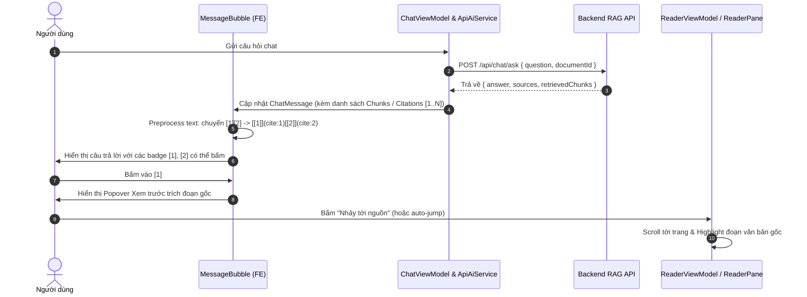

# KẾ HOẠCH TRIỂN KHAI: CLICKABLE CITATIONS TRONG KHUNG CHAT AI (RAG CITATIONS)

---

## 1. TỔNG QUAN & MỤC TIÊU (OBJECTIVES)

### 1.1. Hiện trạng bài toán
- Khi người dùng hỏi đáp (RAG Chat) với bài báo/tài liệu, AI Gemini trả lời kèm các chỉ số trích dẫn trong ngoặc vuông như `[1]`, `[2]`, hoặc các cụm trích dẫn dính liền như `[1][2]`, `[3][4]`, `[1][2][4]` (như trong ảnh chụp).
- **Vấn đề:** 
  1. Các ký tự `[1]`, `[2]` hiện tại là **văn bản thô (plain text)** trong chuỗi Markdown, người dùng **không thể click hay tương tác** được.
  2. Frontend (`ApiAiService`) hiện chỉ hứng mảng tên file `sources: ["paper.pdf"]`, bỏ qua danh sách chi tiết các đoạn trích (`retrievedChunks`) mà Backend gửi về.
  3. Không có sự liên kết ngược (bi-directional navigation) từ bong bóng chat AI sang khung đọc tài liệu (`ReaderPane` / Original PDF Viewer).

### 1.2. Mục tiêu đạt được
1. **Interactive Citations:** Biến toàn bộ các chỉ số `[1]`, `[2]`, `[1][2]`... trong câu trả lời của AI thành **các liên kết / chip trích dẫn có thể bấm được (clickable)**, có giao diện đẹp mắt (badge/superscript, hover highlight).
2. **Citation Preview Popover:** Khi người dùng click (hoặc hover) vào `[1]`, hiển thị popup/dialog nổi bật xem trước:
   - Tên tài liệu / bài báo nguồn.
   - Đoạn trích dẫn gốc (Context excerpt) mà AI đã dựa vào để đưa ra câu trả lời.
   - Số trang / số thứ tự đoạn (Section / Page).
3. **Jump to Source (Deep Linking):** Bấm nút "Xem trong tài liệu" (hoặc tự động khi click vào số trích dẫn):
   - Tự động chuyển trang và cuộn màn hình đọc bài báo (`ReaderPane`) đến đúng vị trí đoạn văn trích dẫn.
   - Kích hoạt hiệu ứng **Highlight phát sáng (flashing highlight)** trong 2-3 giây để người dùng dễ dàng nhận diện vị trí đối chiếu.

---

## 2. NGUYÊN NHÂN GỐC RỄ & PHÂN TÍCH KỸ THUẬT

### 2.1. Phía Backend (`RagService.cs` & `ChatController.cs`)
- Prompt của `RagService` định dạng các chunk theo thứ tự `[Nguồn 1: fileName (Đoạn X)]`, `[Nguồn 2: ...]`.
- LLM đánh số trích dẫn `[1]`, `[2]` dựa trên số thứ tự của context chunk (bắt đầu từ 1).
- `ChatController` đã trả về `retrievedChunks` gồm:
  ```json
  {
    "answer": "...",
    "sources": ["DESC_Surrogate.pdf"],
    "retrievedChunks": [
      {
        "id": 101,
        "documentId": 12,
        "chunkOrder": 3,
        "content": "Nội dung đoạn trích 1...",
        "fileName": "DESC_Surrogate.pdf"
      }
    ]
  }
  ```
- **Hạn chế:** Thứ tự trong `retrievedChunks` hiện tại có thể bị xáo trộn do filter, và chưa tính toán / gán số trang (`pageNumber`) tương ứng trong tài liệu cho từng chunk.

### 2.2. Phía Frontend (`ApiAiService.dart` & `MessageBubble.dart`)
- **`ApiAiService.dart`**: Đang map `rawSources = result['sources']` (chỉ là tên file) thành `Citation`, bỏ quên `result['retrievedChunks']`.
- **`ChatMessage.dart`**: Model `Citation` đã có sẵn (`paperId`, `page`, `excerpt`, `label`), nhưng chưa được fill đúng từ `retrievedChunks`.
- **`MessageBubble.dart`**: Dùng `MarkdownBody(data: message.content)`. Khi gặp `[1]`, markdown parser xem đây là text bình thường (chỉ coi là link nếu có dạng `[1](url)`). Vì thế `onTapLink` không hề được kích hoạt.

---

## 3. KIẾN TRÚC GIẢI PHÁP (ARCHITECTURE & DESIGN)

### 3.1. Luồng dữ liệu (Data Flow)



---

## 4. CHI TIẾT CÁC HẠNG MỤC CẦN THỰC HIỆN

### GIAI ĐOẠN 1: NÂNG CẤP BACKEND & MÔ HÌNH DỮ LIỆU (BE & DATA CONTRACT)

#### Nhiệm vụ 1.1: Chuẩn hóa chỉ số trích dẫn trong `RagService.cs`
- Đảm bảo danh sách `retrievedChunks` trả về cho client giữ **chính xác index tương ứng với số `[1]`, `[2]`, `[3]`, `[4]`** mà LLM đã được cung cấp trong prompt (1-based index).
- Bổ sung ước lượng hoặc tra cứu số trang (`pageNumber`) cho từng chunk:
  - Nếu chunk được tạo từ Grobid XML hoặc PDF Pig có metadata trang: đính kèm `pageNumber`.
  - Nếu chưa có: Backend (hoặc FE) tìm kiếm vị trí của `chunk.content` trong văn bản các trang của `Paper` để tự động xác định số trang chính xác.

#### Nhiệm vụ 1.2: Bổ sung DTO trả về ở `ChatController.cs`
- Trả về danh sách `retrievedChunks` có thêm `sourceIndex`:
  ```csharp
  retrievedChunks = chunks.Select((c, idx) => new {
      sourceIndex = idx + 1, // Tương ứng [1], [2]...
      id = c.Id,
      documentId = c.DocumentId,
      chunkOrder = c.ChunkOrder,
      content = c.Content,
      fileName = c.Document?.FileName,
      pageNumber = c.PageNumber // nếu có
  })
  ```

---

### GIAI ĐOẠN 2: FRONTEND SERVICE & DATA INTEGRATION

#### Nhiệm vụ 2.1: Cập nhật `ApiAiService.dart`
- Khi nhận response từ `/api/chat/ask`, đọc `result['retrievedChunks']`.
- Tự động map từng chunk vào danh sách `Citation`:
  ```dart
  final rawChunks = (result['retrievedChunks'] as List<dynamic>?) ?? [];
  final citations = <Citation>[];
  for (int i = 0; i < rawChunks.length; i++) {
    final c = rawChunks[i];
    final sourceIdx = c['sourceIndex'] ?? (i + 1);
    citations.add(Citation(
      paperId: paperId,
      page: (c['pageNumber'] as int?) ?? _findPageForExcerpt(c['content'], pages),
      excerpt: c['content'] ?? '',
      label: '[$sourceIdx]',
    ));
  }
  ```
- Hàm helper `_findPageForExcerpt(excerpt, pages)`: so khớp chuỗi excerpt với `paper.pages` để xác định trang nào chứa đoạn văn bản này (trả về index trang từ 0 đến N-1).

---

### GIAI ĐOẠN 3: HIỂN THỊ TRÍCH DẪN TƯƠNG TÁC TRONG `MessageBubble`

#### Nhiệm vụ 3.1: Tiền xử lý Markdown để nhận diện `[1]`, `[2]`, `[1][2]`
Có 2 cách thực hiện:
- **Cách tiếp cận tối ưu (Markdown Link Transform):**
  - Trước khi đưa `message.content` vào `MarkdownBody`, dùng Regex quét các số trích dẫn `\[(\d+)\]`.
  - Chuyển đổi chuỗi:
    - Ví dụ: `...vận chuyển (T3D) [1][2].`
    - Thành: `...vận chuyển (T3D) [\[1\]](cite-source:1)[\[2\]](cite-source:2).`
  - Ưu điểm: Tương thích hoàn hảo với `MarkdownBody`, tận dụng sẵn cơ chế `onTapLink`, tự động tách các cụm `[1][2]` thành 2 link độc lập!

#### Nhiệm vụ 3.2: Tùy biến Style cho trích dẫn số
- Trong `MarkdownStyleSheet`:
  - Style cho link trích dẫn: Màu primary, font weight đậm (w600), kiểu dáng badge nhỏ hoặc superscript (chữ nhỏ nhô lên một chút).
  - Có hiệu ứng hover/tap feedback rõ ràng.

#### Nhiệm vụ 3.3: Bắt sự kiện Tap trong `onTapLink` của `MessageBubble`
- Khi link có prefix `cite-source:`:
  ```dart
  if (href.startsWith('cite-source:')) {
    final indexStr = href.substring('cite-source:'.length);
    final sourceIndex = int.tryParse(indexStr);
    if (sourceIndex != null) {
      _showSourceCitationModalOrPopover(context, sourceIndex, message.citations);
    }
    return;
  }
  ```

---

### GIAI ĐOẠN 4: CITATION PREVIEW POPOVER & JUMP TO SOURCE

#### Nhiệm vụ 4.1: Thiết kế Popover / Bottom Sheet xem trước nguồn
Khi người dùng bấm vào số trích dẫn `[1]`:
- Mở một Card/Popover tinh tế tại vị trí bấm hoặc Bottom Sheet (nếu màn hình nhỏ/mobile):
  - **Header:** `Nguồn trích dẫn [1] · Trang X (hoặc Đoạn Y)` + Tên file tài liệu.
  - **Body:** Hiển thị đoạn trích dẫn gốc (Excerpt) mà AI đã trích xuất từ tài liệu, được định dạng rõ ràng trong box trích dẫn có viền trái nổi bật.
  - **Footer:** Nút hành động:
    - 🔍 **"Xem trong bài báo" (Jump to document)**: Khi bấm, đóng popover và kích hoạt cuộn màn hình đọc bài báo tới đúng vị trí.
    - 📋 **"Sao chép đoạn trích" (Copy excerpt)**.

#### Nhiệm vụ 4.2: Cơ chế điều hướng và Highlight trên `ReaderPane`
- Gọi qua callback: `onCitationTap(citation.page, citation.excerpt)`.
- Kết nối tới `ReaderViewModel.navigateToCitation(page, excerpt)`:
  1. `ReaderViewModel` chuyển `currentPage = page`.
  2. `ReaderPane` lắng nghe sự thay đổi, tự động gọi `Scrollable.ensureVisible` cuộn mượt đến đoạn văn bản khớp với `excerpt`.
  3. Kích hoạt hiệu ứng nền sáng nổi bật (`highlightBackground`) nhấp nháy/giữ trong vài giây để người dùng nhận diện ngay lập tức.
  4. Nếu đang ở chế độ xem PDF gốc (`OriginalPdfViewer`): điều hướng PDF viewer sang trang tương ứng (`pdfController.jumpToPage(page)`).

---

## 5. CÁC TRƯỜNG HỢP BIÊN (EDGE CASES) & GIẢI PHÁP PHÒNG NGỪA

| STT | Trường hợp biên (Edge Case) | Cách giải quyết |
|:---:|:---|:---|
| 1 | **Cụm nhiều trích dẫn dính liền:** `[1][2]`, `[3][4]`, `[1][2][4]` | Regex tiền xử lý với `(?<=\])(?=\[)` để tách rời hoặc replace từng `\[(\d+)\]` độc lập, tránh vỡ cú pháp markdown. |
| 2 | **Trích dẫn giả lập khi AI đang gõ (Streaming):** `message.isStreaming == true` | Trong quá trình streaming, các số `[1]` vẫn có thể render link, nhưng danh sách `citations` hoàn chỉnh sẽ được cập nhật khi `isDone == true`. |
| 3 | **Chỉ số `[N]` vượt quá số lượng chunk thực tế** (AI tự sinh ra số lớn hơn số chunk được cung cấp) | Nếu không tìm thấy chunk tương ứng trong `message.citations`, popover hiển thị thông báo "Trích dẫn được suy luận từ ngữ cảnh bài báo" và cho phép tìm kiếm từ khóa trong bài. |
| 4 | **Trích dẫn tài liệu tham khảo học thuật:** `[1] Smith et al.` trong nội dung bài báo | Phân biệt rõ giữa: <br>• `cite-source:X` (Nguồn RAG của câu trả lời AI) <br>• `cite:bX` (Reference học thuật từ Grobid đã có ở bài báo). |

---

## 6. LỘ TRÌNH TRIỂN KHAI & PHÂN CÔNG (ROADMAP)

- **Bước 1 (Backend & Models):** 
  - Hoàn thiện `ChatController` và `RagService` đảm bảo `retrievedChunks` trả về đầy đủ metadata nguồn và thứ tự chunk.
  - Cập nhật `Citation` model và `ApiAiService.dart` trên Flutter để parse chunks.
- **Bước 2 (FE Markdown & Parser):**
  - Viết utility biến đổi `message.content` từ `[N]` sang `[\[N\]](cite-source:N)`.
  - Cập nhật `MessageBubble.dart` để xử lý `onTapLink` cho schema `cite-source:`.
  - Viết Unit Test kiểm tra các trường hợp `[1]`, `[1][2]`, `[1][2][4]`.
- **Bước 3 (UI Popover & Reader Deep Link):**
  - Xây dựng component `CitationPreviewDialog` / Popover hiển thị trích đoạn.
  - Kết nối callback `onCitationTap` với `ReaderViewModel` và `ReaderPane` để auto-scroll và highlight.
- **Bước 4 (Testing & Polish):**
  - Chạy thử nghiệm thực tế với các câu hỏi phức tạp trên bài báo.
  - Kiểm tra giao diện trên cả Dark Mode và Light Mode, đảm bảo tính thẩm mỹ cao.
